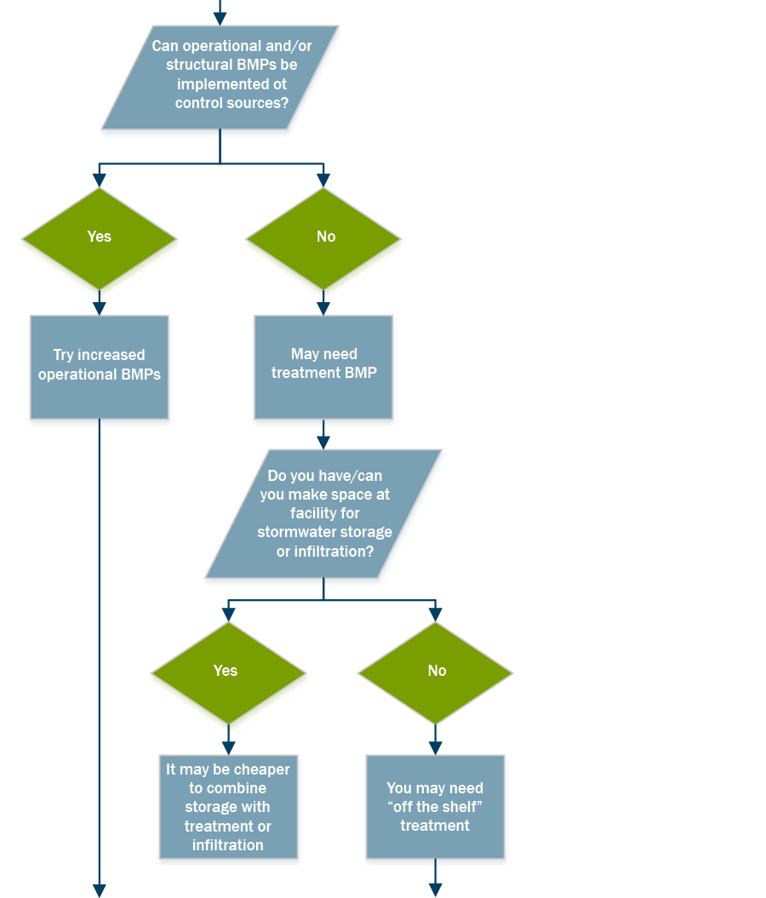

# Laboratory results indicate that I might have a problem

	

		

			<a href='#'>List of potential zinc sources</a>
		

	

	

		

			<a href='#'>List of BMPs</a>
		

		

			<a href='#'>List of Vendors</a>
		

	

